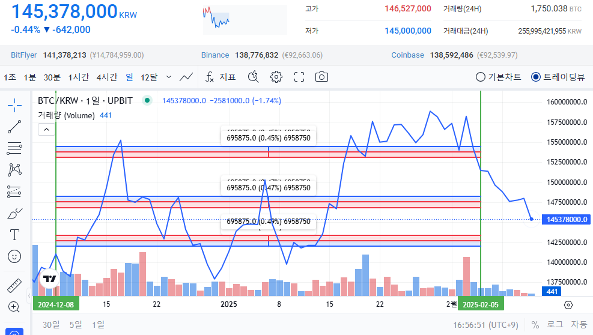

# Upbit BTC Analysis
Upbit API를 활용하여 특정 암호화폐의 지지 및 저항 구간을 거래량을 기반으로 분석하여 이를 시각화하고, UPCI 공포지수를 이용해 단기 추세를 예측합니다.

## 목차
- [기능](#기능)
- [프로젝트 구조](#프로젝트-구조)
- [설치 및 실행 방법](#설치-및-실행-방법)
- [실행 결과](#실행-결과)
- [결과 해석](#결과-해석)
- [시각화](#시각화)
- [데이터 분석](#데이터-분석)
- [구간의 유효성 검증](#구간의-유효성-검증)
- [변동성 예측 과정](#변동성-예측-과정)
- [업데이트 예정 사항](#업데이트-예정-사항)

## 기능
- Upbit API를 이용한 최근 60일간의 데이터 크롤링
- 데이터 전처리를 통해 가독성을 높인 후 분석
- 가격 구간을 40개의 범위로 나누어 거래량을 기반으로 지지 및 저항 구간 도출
- 지지와 저항 구간을 시각화하고 단기 추세를 예측

## 프로젝트 구조
```
├── 📂 src
│   ├── DAY1.png
│   ├── DAY2.png
│   ├── DAY5.png
│   ├── DAY7.png
│   └── sample_result.png
├── .gitignore
├── README.md
├── main.py
├── requirements.txt
└── utils.py
```

## 설치 및 실행 방법
1. 필수 라이브러리 설치
```
pip install -r requirements.txt
```
2. 프로그램 실행
```
python main.py
```

## 실행 결과
> 📆 2025-02-13
>
> 

### 결과 데이터
#### 1. PRICE_BIN_START
- 가격 구간의 시작 지점
#### 2. PRICE_BIN_END
- 가격 구간의 끝 지점
#### 3. TRADING_VOLUME
- 가격 구간별 거래량의 총합
#### 4. VARIANCE
- 가격 구간별 전일 대비 가격 상승률의 평균

## 결과 해석
#### VARIANCE > 0
- 해당 가격 구간대에서 가격을 상승시키려는 영향력이 강함
#### VARIANCE < 0
- 해당 가격 구간대에서 가격을 하락시키려는 영향력이 강함

## 시각화
> 업데이트 예정

## 데이터 분석
> ### DAY 1
> 
> 📆 2025-02-06

> 🟥 지지 구간 🟦 저항 구간
>
> 

### 📆 2025.01.16
- 많은 거래량을 바탕으로 강한 지지를 받습니다.
### 📆 2025.01.17
- 이전 저항 구간을 돌파하며, 반등의 가능성을 보입니다.
- 실제로 빠르게 반등하는 모습을 보입니다.
### 📆 2025.01.19
- 하락하는 변동성을 보입니다.
- 하락의 범위는 이전 지지 구간까지로 예측할 수 있습니다.
### 📆 2025.01.20
- 많은 거래량을 바탕으로 강한 지지를 받습니다.
- 새로운 지지 구간을 형성합니다.
### 📆 2025.02.02
- 진동 형태의 변동성을 보이며 지지 구간에 도달합니다.
- 다시 한 번 지지를 받으며 반등합니다.
### 📆 2025.02.04
- 상승의 추세를 이어가지 못하고 다시 지지 구간에 도달합니다.
### 📆 2025.02.05
- 결국 지지 구간을 돌파하며, 하락의 가능성을 보입니다.
- 하락의 범위는 이전 지지 구간까지로 예측할 수 있습니다.

## 구간의 유효성 검증
> ### DAY 2
>
> 📆 2025-02-07

> ✅ 지지 구간을 돌파하고 가격이 빠르게 하락합니다.

> 🟥 지지 구간 🟦 저항 구간
>
> 

> ### DAY 5
> 
> 📆 2025-02-10

> ✅ 이전 지지 구간에서 약한 지지를 받습니다.

> 🟥 지지 구간 🟦 저항 구간
>
> 

> ### DAY 7
> 
> 📆 2025-02-12

> ✅ 이전 저항 구간에서 크게 저항을 받아 가격이 크게 하락합니다.

> 🟥 지지 구간 🟦 저항 구간
>
> 

## 변동성 예측 과정
1. UPCI 공포지수 크롤링
2. 공포지수 변화를 기반으로 예측 자동화

## 업데이트 예정 사항
#### 1. 시각화
- 가격 구간별 거래량을 히스토그램으로 시각화
#### 2. 변동성 예측 (업데이트 ✅)
- UBCI 공포지수 크롤링
- 공포지수 변화를 기반으로 예측 자동화